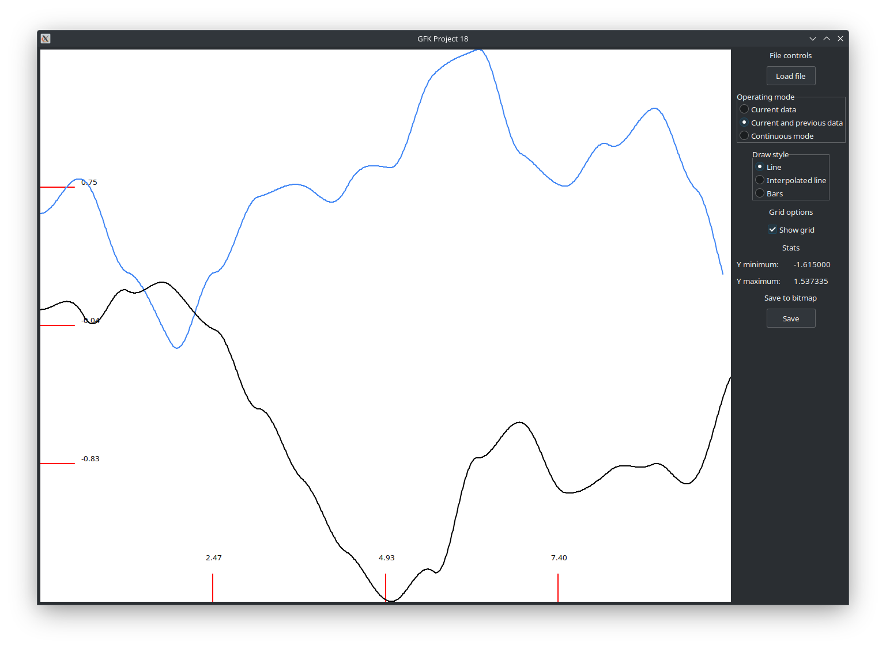

# Fundamentals of Computer Graphics Project - Live Data Plotter

This project aims to create a tool for visualizing how a single parameter changes over time.  

Additionally, the tool supports simultaneous visualization of two waveforms: one representing real-time data and the other a previously recorded waveform.

## Libraries Used
- **wxWidgets** – Used for building the graphical user interface.

